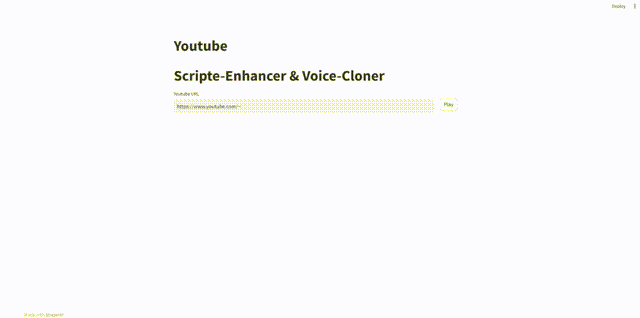
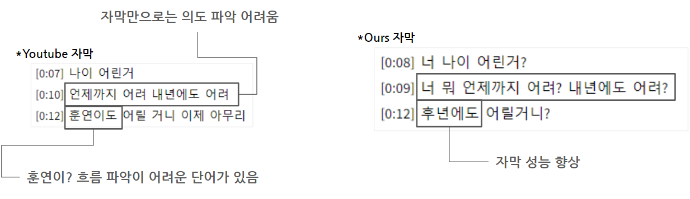
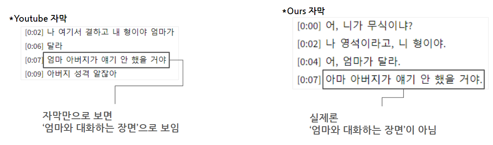
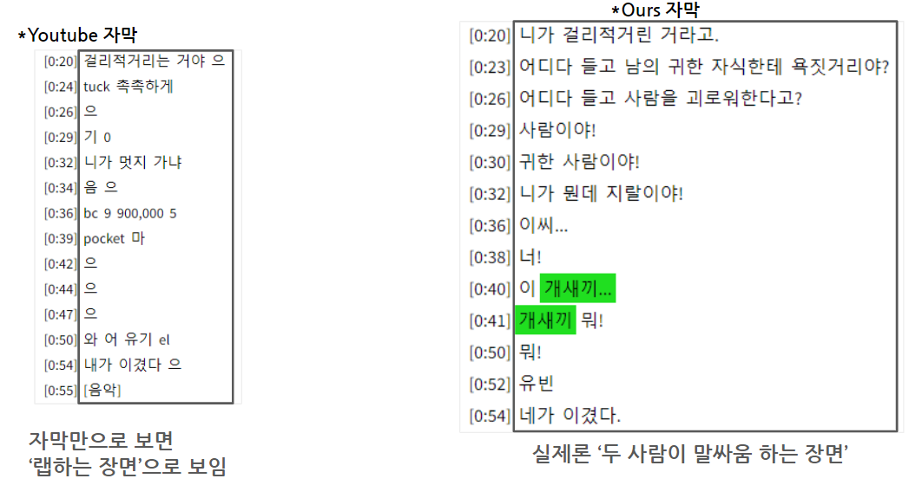

### 프로젝트 주제

```
유튜브 자동 자막의 성능 문제 개선 & 욕설 탐지 및 제거 
```

### 담당

|이름|담당|업무|
|:---:|:---:|:---:|
|이태훈|코드 통합,<br/>STT,<br/>자동 영상 편집|GCP 환경 구성,<br/>Streamlit 구현,<br/>STT 구현 ,<br/>욕설 삐소리 기능 구현,<br/>욕설 리스트를 활용한 욕설 탐지|
|신유진|욕설 탐지|욕설탐지모델 구현, <br/>XAI 구현|
|김연수|욕설 제거|TTS 구현, <br/>Voice Cloning 모델 구현|
|김석영|영어 탐지(+제거)|영문 탐지 프롬프트 엔지니어링,<br/>영문 변환 프롬프트 엔지니어링|


### Version

- Python 3.10

### 0. 실행(run)

```bash
# 0. ffmpeg 설치 
# 윈도우 : https://angelplayer.tistory.com/351 사이트 참고
# 우분투
sudo apt update
sudo apt install ffmpeg
ffmpeg -version

# 1. 가상환경 생성
python -m venv ysevc

# 2. 가상환경 실행
ysevc\Scripts\activate

# (별도) torch gpu 설치 
pip install torch torchvision torchaudio --index-url https://download.pytorch.org/whl/cu121

# 3. Whisper 설치
pip install -U openai-whisper
        or
pip install git+https://github.com/openai/whisper.git

# 4. requirements.txt 설치
pip install -r requirements.txt  

# 5. Streamlit 실행
streamlit run main.py
```

### 1. 결과 (시연 영상)



- 자세히 보고 싶으시면 `result/시연영상.mp4` 가 있습니다


### 2. 결과 파일(result)

```bash
결과물은 result 폴더에서 확인이 가능합니다.

1. txt 파일 : 본 프로젝트를 통해 생성된 자막
2. mp4 : 본 프로젝트를 통해 생성된 욕설이 삐소리 처리된 영상

*욕설 표시는 코드에서 구현이 되어, txt파일에서 확인이 어렵습니다.
```

### 3. 속도

### 3.1 Speech-To-Text (STT)

```bash
- Model : Whisper-small
- GPU : 4060 Ti
- 입력 : 약 1분 길이의 영상
- 시간 : 평균 13초 소요
```

```
- 속도 개선 방법
    - Whisper.cpp 대체
    - Faster-Whisper 대체 
        1. 시도해봄
        2. 추론은 빠름.(CPU에서도 1분 영상이 약 10초 내로 끝남) 
        3. 단, 결과물이 Segment 클래스로 생성이 되는데, 이를 활용하는데 오래 걸림(ex. for문을 이용하여 결과물을 꺼내오는데, 30초 이상이 걸림)
        4. 원인 분석 : 
            - 결과 데이터 양도 적으나 오래 걸림
            - 라이브러리 내 코드 문제 의심
        5. 해결 시도
            - 결과가 [ Segment(),Segment(),Segment() ... ] 와 같이 나옴
            - Semgent 안에 있는 정보는 dict과 동일해서 as_dict() 시도 했으나 메소드 없음
            - 결과를 list() 변환하면 추후 사용에 속도에 문제 없음을 확인!
            - 단, list()로 변환하는데 50초 이상이 걸림. 즉, 결국 일반 Whisper와 동일하거나 오히려 더 느린 결과가 나옴.
```

### 3.2 영상 편집

```
# ffmpeg을 이용하여 영상을 편집함
- 시간 : 영상 길이 1분 당 평균 1분이 걸림
- 원리 : 
    1. 욕설 단어의 프레임 추출
    2. ffmpeg를 이용해 욕설이 있는 프레임은 beep.wav로 대체
    3. 그 외에는 원본 소리 사용
```

### 4. 성능

### 4.1 STT

```
- 타입 : 정성적 평가
- 이유 : 
    - 정량적 평가를 위한 라벨 구축의 어려움.
    - 라벨 구축이 어려운 이유 : 
        - 영상을 보고, 자막을 직접 손으로 작성해야함. 이 과정은 시간이 오래 걸리며, 적은 개수로 정성적 평가 시도시 편파적인 결과(우리가 희망하는 평가 결과)가 나올 수 있음. 
```

> 더글로리 영상(https://www.youtube.com/watch?v=bGFkdfYPPAo)


> 카지노 영상(https://www.youtube.com/watch?v=5-7NPzsgAag)


> 멜로가체질 영상(https://www.youtube.com/watch?v=t7aJ1WvVCCI)



---

### Reference

- 유튜브 스크립트 가져오기 : [youtube_transcript_api](https://github.com/jdepoix/youtube-transcript-api)
- [GCP에서 Streamlit 방화벽 해결](https://velog.io/@bandi12/GCP%EC%97%90%EC%84%9C-streamlit-%EC%8B%A4%ED%96%89%ED%95%98%EA%B8%B0)